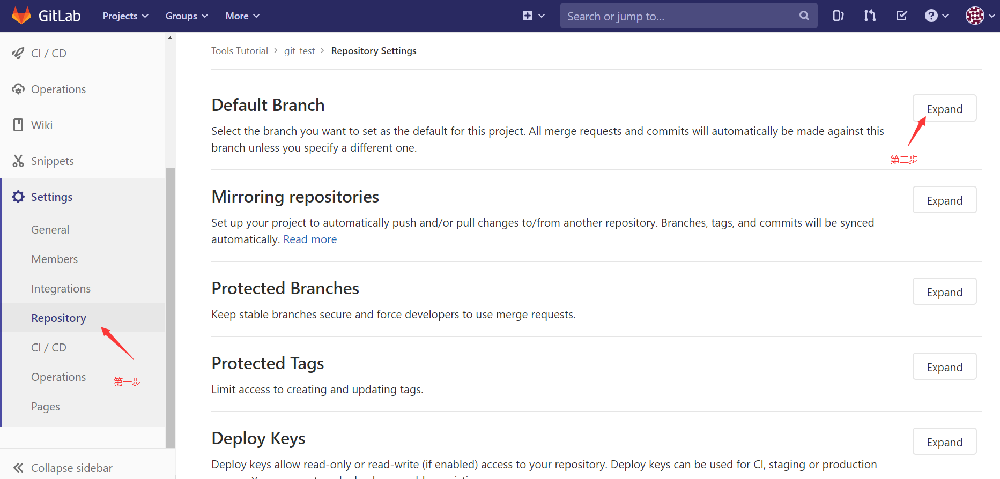
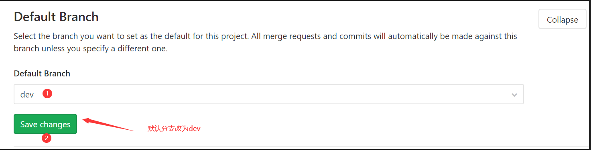
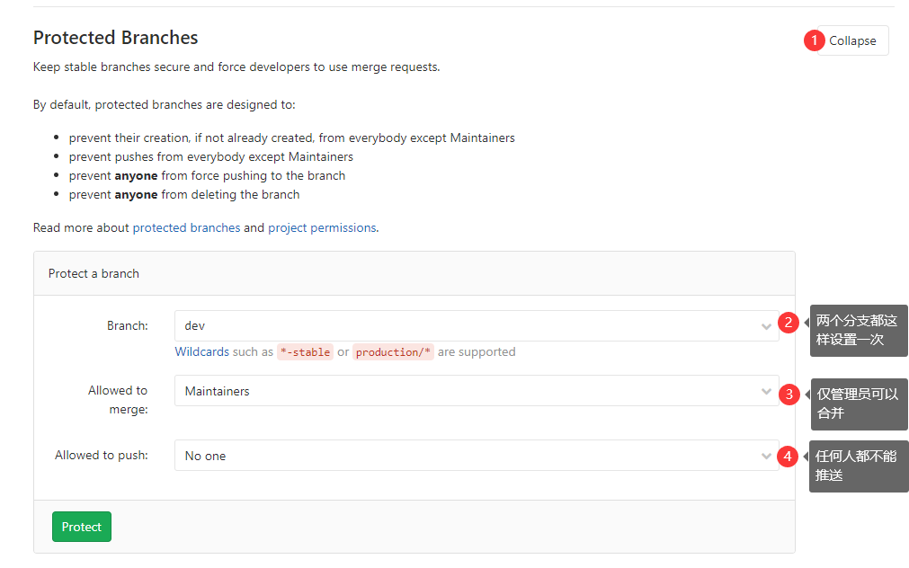
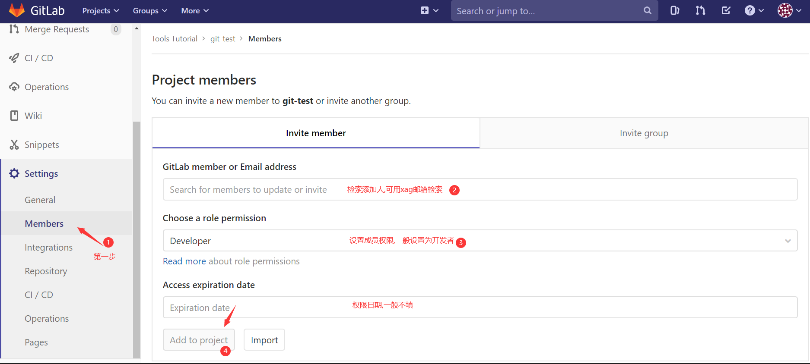
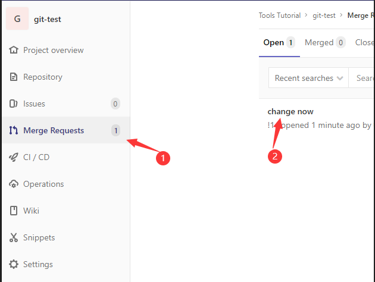
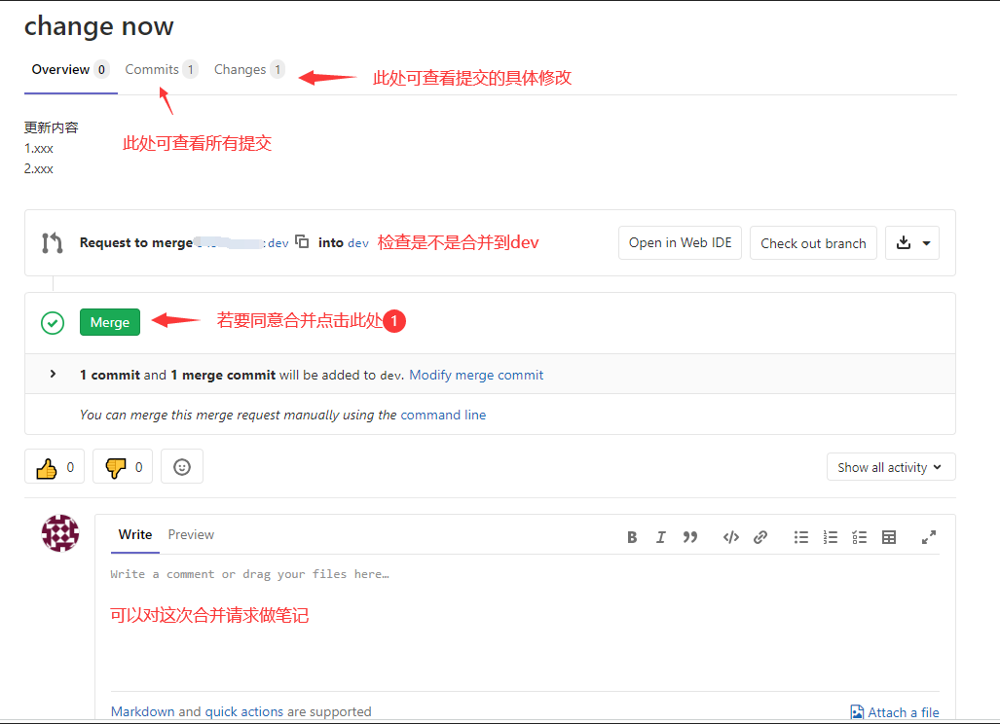
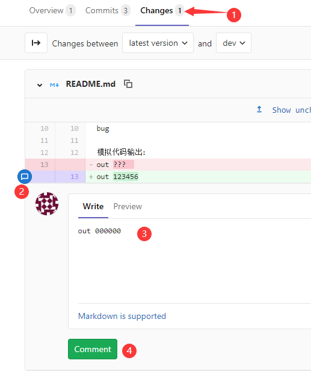
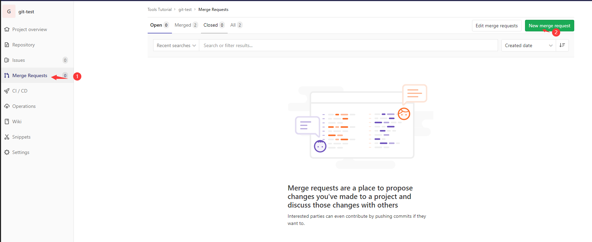
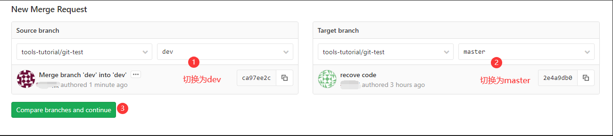
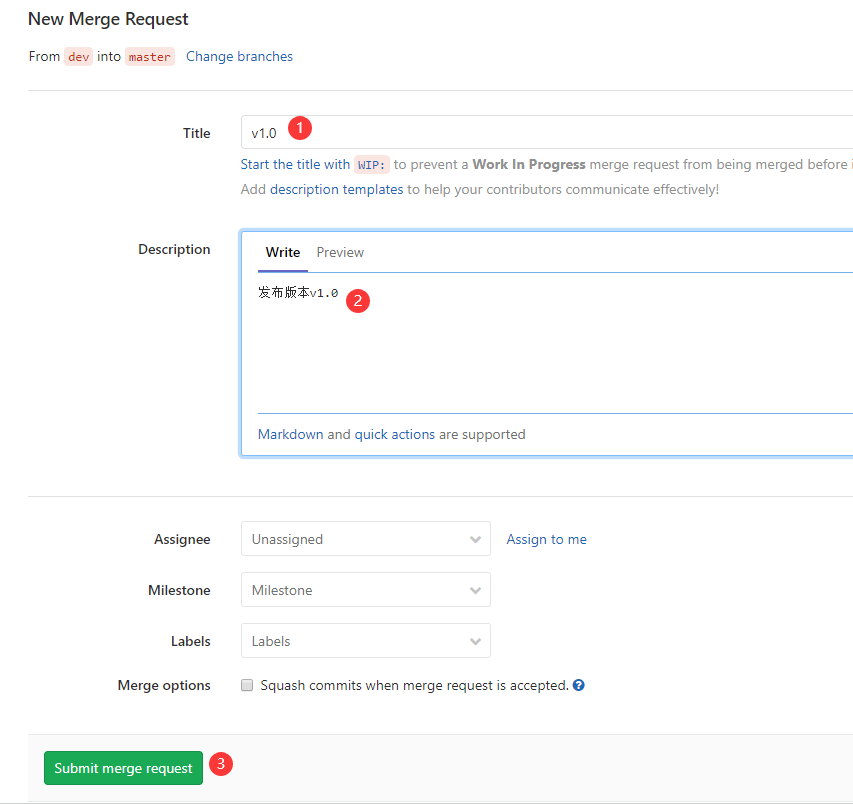

# 主仓库管理员操作介绍
## 可参考的提交规范
[Git 使用规范流程](http://www.ruanyifeng.com/blog/2015/08/git-use-process.html)

## 建立主仓库
1. 建立一个本地仓库,该仓库存在`master`与`dev`.  
   `git push origin --all`将两个分支都推送上GitLab.  
2. 修改远程仓库的默认分支.  
     
     
3. 在下面的选项中增加两个分支的保护.  
     
4. 添加开发人员
     

## 处理合并请求
1. 查看合并请求  
     
2. 处理合并请求  
     
- 注意: 当前开发流程中测试流程将会交给开发者进行验证,若是进行一个开源项目,需要将合并请求改到一个新分支上自己测试程序.
- 若管理员不满意合并请求,可进行评价让其修改:  
     

## 发布新版本  
1. 发起将`dev`合并到`master`的请求  
     
     
     
2. 按上面处理合并请求的方法同意合并即可.
3. 增加[Releases](创建Releases.md/#GitLab/##操作流程),内容为发布版本的版本号.
